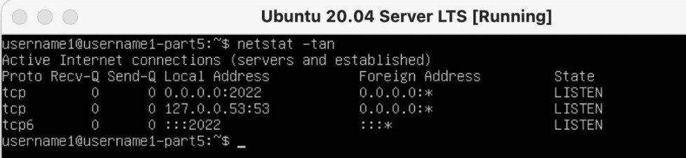
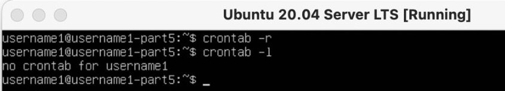

# ОТЧЕТ ПО ВЫПОЛНЕННОЙ РАБОТЕ
## Part 1. Установка ОС
- Текущая версия Ubuntu:\

## Part 2. Создание пользователя
- Команда для создания пользователя:\

- Вывод:\

## Part 3. Настройка сети ОС
- Изменение названия машины: `sudo vim /etc/hostname`
- Установка временной зоны:\

- Названия сетевых интерфейсов:\

На системах Unix интерфейс loopback обычно имеет имя lo или lo0. Интерфейс loopback имеет несколько путей применения. Он может быть использован сетевым клиентским программным обеспечением, чтобы общаться с серверным приложением, расположенным на том же компьютере.
- Получение ip адреса устройства от DHCP сервера:\

DHCP (англ. Dynamic Host Configuration Protocol — протокол динамической настройки узла) — сетевой протокол, позволяющий сетевым устройствам автоматически получать IP-адрес и другие параметры, необходимые для работы в сети TCP/IP. Данный протокол работает по модели «клиент-сервер». Для автоматической конфигурации компьютер-клиент на этапе конфигурации сетевого устройства обращается к так называемому серверу DHCP и получает от него нужные параметры. Сетевой администратор может задать диапазон адресов, распределяемых сервером среди компьютеров. Это позволяет избежать ручной настройки компьютеров сети и уменьшает количество ошибок. Протокол DHCP используется в большинстве сетей TCP/IP.
- Внешний ip-адрес шлюза:\

- Внутренний ip-адрес шлюза:\

- Установка статических настроек ip, gw, dns:\

Команда для проверки `ip route show`
- Для перезагрузки машины использовал команду `reboot`
- Пинговка удаленных хостов:\

## Part 4. Обновление ОС
- Обновления отсутствуют:\

## Part 5. Использование команды sudo
Команда `sudo` предоставляет возможность пользователям выполнять команды от имени суперпользователя root, либо других пользователей.

## Part 6. Установка и настройка службы времени
- Настройка службы автоматической синхронизации времени:\

## Part 7. Установка и использование текстовых редакторов
- VIM:
    - Выход с сохранением: esc, :, wq, enter.\

- NANO:
    - Выход с сохранением: ctrl + x, y, enter.\

- MCEDIT:
    - Выход с сохранением: fn + f2, yes(enter).\

- VIM:
    - Выход без сохранения: esc, :, q!, enter.\

- NANO:
    - Выход без сохранения: ctrl + x, n, enter.\

- MCEDIT:
    - Выход без сохранения: fn + f10, no(enter).\

- VIM:
    - Поиск: esc, /шаблон
    - Замена: s/шаблон/замена\

- NANO:
    - ctrl + '\\'
    - Поиск: ввод строки, enter.
    - Замена: ввод замены, enter.\

- MCEDIT:
    - fn + f4
    - Поиск: ввод строки
    - Замена: ввод замены, ok, enter.\

## Part 8. Установка и базовая настройка сервиса SSHD
Команда ps выводит список текущих процессов на вашем сервере в виде таблицы, с которой можно удобно работать: сортировать, изменять количество колонок и прочие. У утилиты ps множество настроек, с помощью которых можно тонко настраивать вывод команды, также никто не запрещает вам делать конвейеры, чтобы отсечь всё лишнее.

- Команда для установки SSHd: `sudo apt install openssh-server`
- Команда для добавление автостарта: `sudo systemctl enable ssh`
- Перенастройка службы SSHd на порт:\

- Вот список опций выбора процессов для отображения:
    - -A, -e, (a) - выбрать все процессы;
    - -a - выбрать все процессы, кроме фоновых;
    - -d, (g) - выбрать все процессы, даже фоновые, кроме процессов сессий;
    - -N - выбрать все процессы кроме указанных;
    - -С - выбирать процессы по имени команды;
    - -G - выбрать процессы по ID группы;
    - -p, (p) - выбрать процессы PID;
    - --ppid - выбрать процессы по PID родительского процесса;
    - -s - выбрать процессы по ID сессии;
    - -t, (t) - выбрать процессы по tty;
    - -u, (U) - выбрать процессы пользователя.

- Наличие процесса sshd:\

- Для перезагрузки машины использовал команду `reboot`

- Вывод команды `netstat -tan`:\

- Объяснение команды `netstat -tan`:
    - -t: перечислить TCP порты
    - -a: перечислить все порты
    - -n: разрешить имена

- В столбце Proto указан протокол, по которому ведется работа с портом. Возможные значения таковы: tcp (ТСР-сокеты), udp (UDP-сокеты) и raw (неструктурированные сокеты). В столбце Recv-Q приведено число пакетов, принятых ядром, но еще не прочитанных демоном, прослушивающим данный порт. В столбце Send-Q отображается число пакетов, для которых ожидается подтверждение от удаленного узла.
- В столбце Local Address показаны IP-адрес локального узала и логическое имя порта. В рассмотренном выше примере первая запись соответствует сеансу telnet. Если вместо IP-адреса стоит звездочка, то это означает, что демон прослушивает все сетевые интерфейсы.
- В поле Foreign Address отображаются IP-адрес удаленного узла и порт, с которым установлено соединение. В случае сеанса telnet удаленный клиент работает с портом 1062 (локальному клиенту соответствует стандартный порт 23).
- Столбец State применим только к TCP-соединениям и сообщает о состоянии соединения: CLOSING, CLOSED, CLOSE_WAIT, ESTABLISHED, FIN_WAIT1, FIN_WAIT2, LAST_ACK, LISTEN,SYN_SENT,SYN_RECV,TIME_WAIT.
- В этом выводе 0.0.0.0 представляет любые доступные IP-адреса этого компьютера.

## Part 9. Установка и использование утилит top, htop
- Вывод команды `top`:
    - uptime: 52 min.
    - количество авторизованных пользователей: 1
    - общую загрузку системы: 0.00
    - общее количество процессов: 93
    - загрузку cpu: 0.0
    - загрузку памяти: 137.5
    - pid процесса занимающего больше всего памяти: 1
    - pid процесса, занимающего больше всего процессорного времени: 1\

- Сортировка `htop` PID:\

- Сортировка `htop` PERCENT_CPU:\

- Сортировка `htop` PERCENT_MEM:\

- Сортировка `htop` TIME:\

- Фильтр `htop` по sshd:\

- Поиск `htop` syslog:\

- Добавление в вывод `htop` hostname, clock и uptime:\

## Part 10. Использование утилиты fdisk
- Disk: /dev/sda VBOX HARDDISK
- Size: 30 GiB.
- Amount sectors: 62914560
- Swap size: 2.9 Gi (free -h)

## Part 11. Использование утилиты df
- df:
    - Size: 14339080
    - Used: 5777156
    - Available: 7811744
    - Use: 43%
- По умолчанию, количество места на дисках выводится в килобайтах, если не указан какой-либо ключ.

- df -Th:
    - Size: 14G
    - Used: 5.6G
    - Available: 7.5G
    - Use: 43%
- Тип файловой системы: ext4

## Part 12. Использование утилиты du
- /home:\

- /var:\

- /var/log:\

- /var/log *:\

## Part 13. Установка и использование утилиты ncdu
- Команда для установки: `sudo apt install ncdu`
- /home:\

- /var:\

- /var/log:\

## Part 14. Работа с системными журналами
- Время последней авторизации: 16:03:50
- Имя пользователя: username1
- Метод входа: su
- Рестарт службы:\

## Part 15. Использование планировщика заданий CRON
-  Список текущих заданий:\

- Выполнение:\

- Удаление:\
